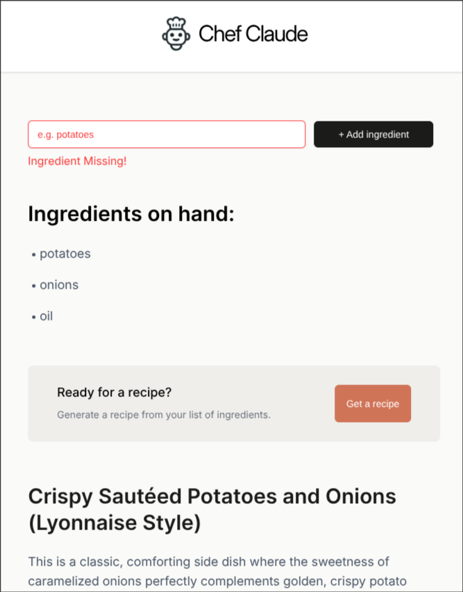
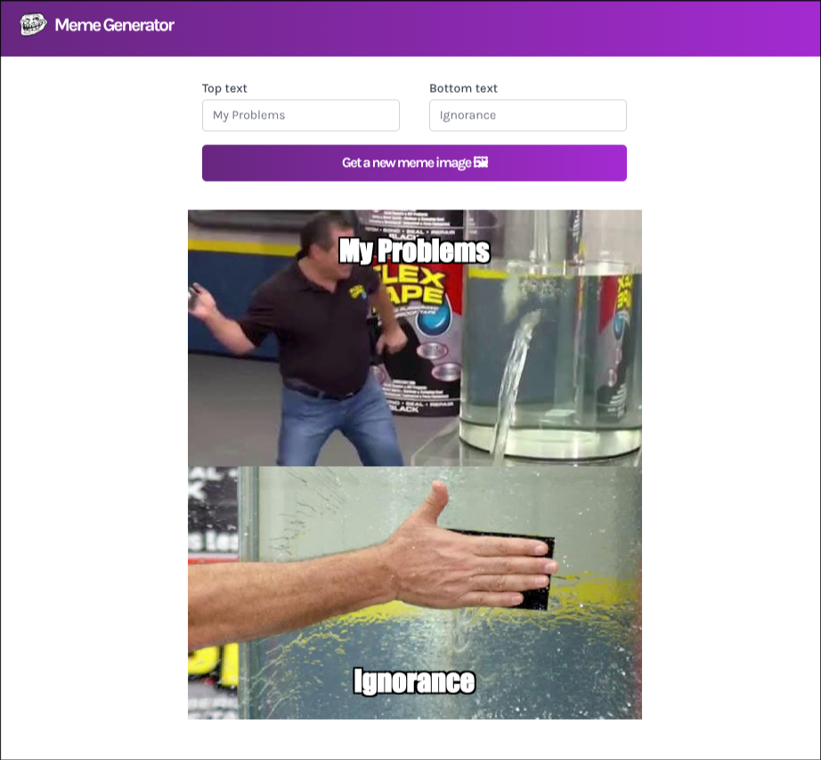
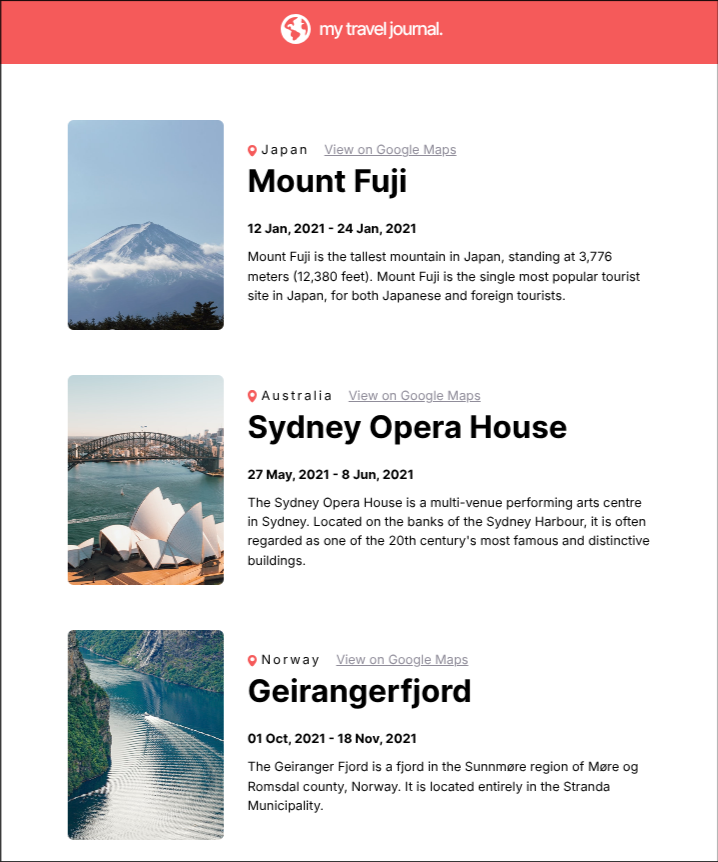
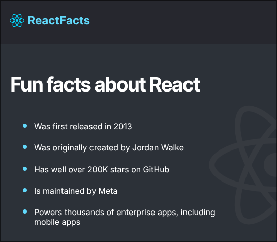

# 🚀 Frontend Development Lab

This repository contains my comprehensive journey through frontend web development, bridging the gap between foundational academic coursework and modern library-based application building.

The content is divided into two main tracks:

1.  **Academic Coursework:** Core HTML, CSS, and Vanilla JavaScript projects developed during my **Semester 4 Frontend Development course at UPES**.
2.  **Modern React Development:** Component-based applications built while following the **freeCodeCamp React Course** instructed by **Bob Ziroll**.

---

## React Applications (Featured)

These projects were built to master state management, hooks, and reusable UI components.
_Special thanks to **Bob Ziroll** for the instructional guidance on these applications._

### 👨‍🍳 Chef Claude



An AI-integrated recipe generator that suggests meals based on a list of ingredients provided by the user.

- **Key Learning:** State management with arrays, conditional rendering, and complex forms.
- **Tech:** React, Vite, CSS Modules.

### 🖼️ Meme Generator



A dynamic app that fetches trending meme templates and allows for real-time text overlays.

- **Key Learning:** `useState`, `useEffect`, and handling side effects via API calls.
- **Tech:** React, Vite.

### 🗺️ Travel Journal



A data-driven layout showcasing various travel destinations with mapped components.

- **Key Learning:** Props, data mapping, and clean UI architecture.
- **Tech:** React.

### React Facts



A lightweight exploration of JSX syntax and basic static component nesting.

- **Tech:** React, Vite.

---

## 🎓 College Coursework (UPES Sem 4)

The following projects and samples were developed as part of my formal education, focusing on the fundamentals of the Document Object Model (DOM) and responsive web design.

| Project / Folder      | Focus                                                                  |
| :-------------------- | :--------------------------------------------------------------------- |
| **About Me**          | A personal profile page exploring layout and social media integration. |
| **FakeChat**          | Building a messaging interface UI using CSS Flexbox/Grid.              |
| **Password Strength** | JavaScript logic to evaluate and visualize password complexity.        |
| **HTML Playground**   | Experimental space for testing new HTML5 tags and properties.          |
| **Samples/**          | Practical exercises on DOM manipulation and Table structures.          |

---

## 📂 Repository Structure

```bash
.
├── Docs/           # Academic syllabus and CP resources
├── Media/          # Social icons, logos, and UI assets
├── Samples/        # Core HTML/DOM learning snippets
├── WebPages/       # Vanilla JS & CSS projects (College Coursework)
└── WebPages/Test/  # React Projects (freeCodeCamp Curriculum)
```

---

## 🛠️ Installation & Setup

### For React Projects:

Navigate to any project directory within `WebPages/Test/`:

```bash
cd WebPages/Test/ChefClaude
npm install
npm run dev
```

### For Vanilla Projects:

These are static files. Simply open the `index.html` file in any folder under `WebPages/` or `Samples/` directly in your browser.

---

### Credits

- **Academic:** UPES University - Frontend Development Curriculum.
- **React Instruction:** Bob Ziroll via [freeCodeCamp](https://www.youtube.com/watch?v=bMknfKXIFA8).

---

\*Maintained by Nothinormuch
